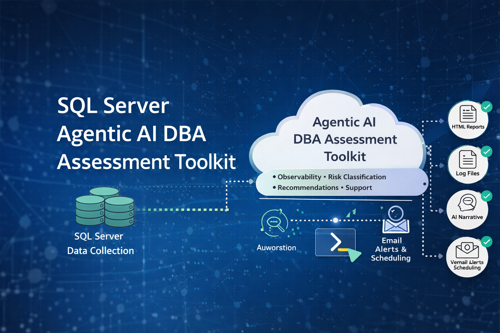

# SQL-Server-Agentic-AI-DBA-Assessment-Toolkit

Enterprise-grade SQL Server assessment and automation toolkit designed to simulate an **Agentic AI DBA** for on-prem environments.

---

> ⚠️ **Disclaimer:**  
This toolkit is intended for demonstration and controlled use only.  
It is not designed for unrestricted public production deployment.  
Private implementation and customization support is available.

---

## 🚀 Overview

This project provides a structured, automated approach to assessing SQL Server environments across three critical domains:

- **Operational Health & Performance**
- **Configuration & Best Practices Compliance**
- **Security & Vulnerability Exposure**

The toolkit is built using PowerShell and leverages native SQL Server system views to generate **HTML-based reports** suitable for both technical teams and leadership review.

---

## 🧠 What This Toolkit Does

This solution acts as a **lightweight Agentic AI DBA framework**, performing:

- Automated data collection from SQL Server
- Rule-based evaluation of system state
- Risk classification and prioritization
- Report generation with actionable recommendations
- Optional automation and scheduling
- Optional AI-ready integration layer

---

## 📊 Reports Included

### 1. DBA Agent Technical Report

**Purpose:**  
Provides a deep operational and performance assessment of the SQL Server instance.

**Focus Areas:**
- Backup failures and gaps
- SQL Agent job failures
- DBCC CHECKDB recency
- Wait statistics analysis
- Blocking and performance indicators
- Database file and log health
- Actionable operational queue

**Outcome:**  
Identifies immediate operational risks and performance issues requiring DBA attention.

---

### 2. Best Practices Compliance Report

**Purpose:**  
Evaluates the SQL Server instance against commonly accepted DBA best practices.

**Focus Areas:**
- Max server memory configuration
- MAXDOP and cost threshold for parallelism
- Optimize for ad hoc workloads
- TempDB configuration
- Page verification settings
- Statistics configuration
- Query Store usage
- Database integrity maintenance (DBCC)

**Outcome:**  
Highlights configuration gaps and areas where the system deviates from recommended standards.

---

### 3. Vulnerability Assessment Report

**Purpose:**  
Performs a security-focused assessment of SQL Server exposure and risk.

**Focus Areas:**
- `sa` account status
- Sysadmin role membership
- Authentication mode (Windows vs Mixed)
- Surface area configuration (xp_cmdshell, OLE, CLR)
- TRUSTWORTHY database settings
- Guest user access
- Orphaned users
- Linked server exposure
- Security scoring and risk classification

**Outcome:**  
Provides a prioritized view of security risks with supporting evidence and remediation steps.

---

## ⚙️ How It Works

1. PowerShell scripts connect to SQL Server
2. System views and metadata are queried
3. Rules evaluate configuration and behavior
4. Findings are categorized:
   - Pass
   - Review
   - Fail
5. HTML reports are generated
6. Optional:
   - Automation (scheduled execution)
   - Email delivery
   - AI narrative integration

---

## ▶️ How to Run

See full instructions:

```text
automation/HOW_TO_RUN.md
